## Connect Dialogflow & Firebase with Fullfillment

---

**Related file : src/firebase/dialogflowSetting/firebase_schedule , src/getFoodlist**

### 1. DialogFlow Setting

1. **Make Actions console project**
    - https://console.actions.google.com/
    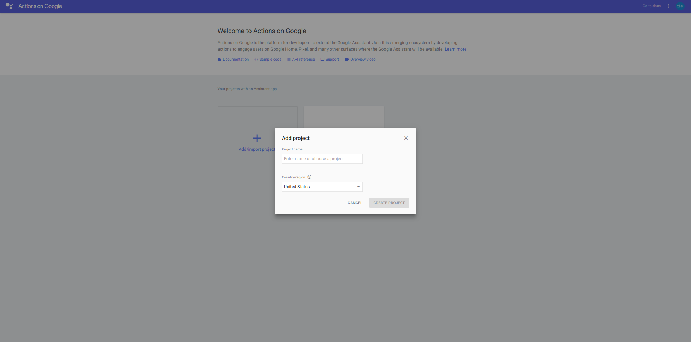


2. **Enable Google Assistant API**
    - https://console.developers.google.com/apis/api/embeddedassistant.googleapis.com/overview
    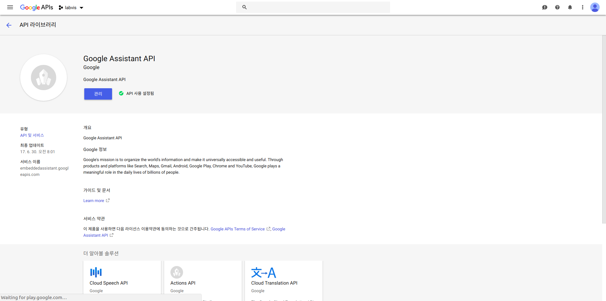


3. **Register Device (ex : raspberry pi3)**
    - https://console.actions.google.com/
    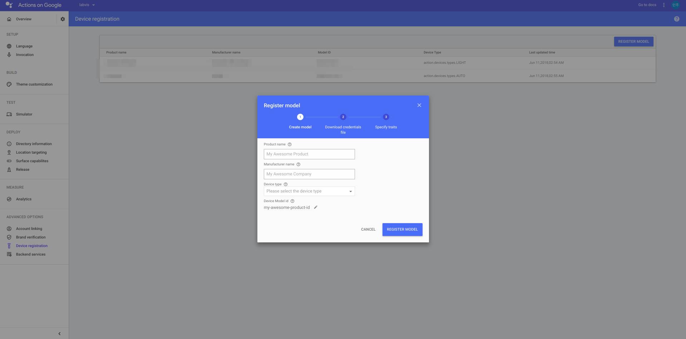

    - **If you can't find 'device restration' section**
      - https://developers.google.com/assistant/sdk/guides/service/python/extend/custom-actions
      - make json and make information

    - **Download Credential.json**


4. **Configure Environment**

    - **python3**

    ```bash
    sudo apt-get update
    sudo apt-get install python3-dev python3-venv
    python3 -m venv env
    env/bin/python -m pip install --upgrade pip setuptools wheel
    source env/bin/activate
    ```


    - **python2.7**

    ```bash
    sudo apt-get update
    sudo apt-get install python-dev python-virtualenv
    virtualenv env --no-site-packages
    env/bin/python -m pip install --upgrade pip setuptools wheel
    source env/bin/activate
    ```


    - **Get package**
    
    ```bash
    sudo apt-get install portaudio19-dev libffi-dev libssl-dev
    python -m pip install --upgrade google-assistant-sdk[samples]
    ```

    - **Generate credentials**

    ```bash
    python -m pip install --upgrade google-auth-oauthlib[tool]
    google-oauthlib-tool --scope https://www.googleapis.com/auth/assistant-sdk-prototype --save --headless --client-secrets **/path/to/credentials.json**
    ```

---


### 2. DialogFlow Setting


1. **Make Agent**
  - Make agent and select google project you created before
  
  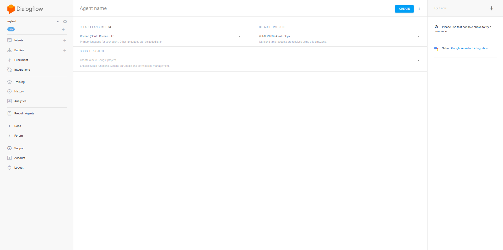

2. **Make Entities**

  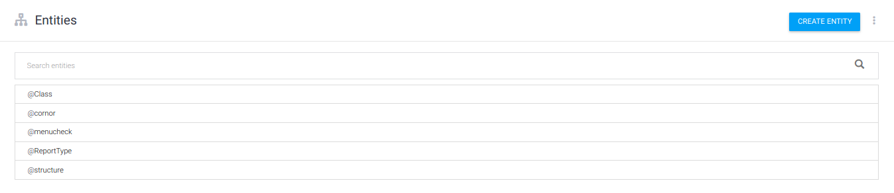


3. **Make Intent**

  - **Most Important Thing**
  - **Intent will be export in your app later with firebase functions. Remeber name of Intent!!**
  - I user only **Training phrases, Actions and and parameters, Fullfillment** sections.


    |SECTION|INFO|
    |--------|---|
    |Training phrases|input what you will ask to assistant|
    |Action and parameters|check your entities, required, prompts. You will use **PARAMETER NAME** in firebase functions, so remove '-' in its name
    |Prompts|make som quistions assistant ask to you for get entity|
    |Fullfillment|check **Enable webhook call for this intent** |
    

4. **EX**
    - **intent_list**
    
    
    
    - **intent info**

    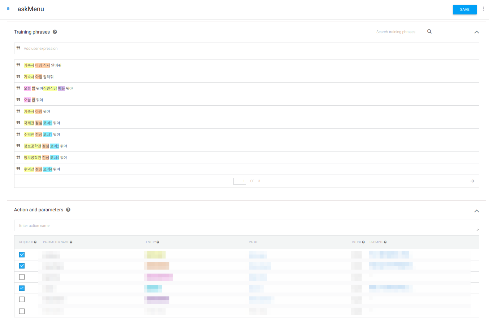


---
### 3. Firebase Setting

1. **Install NodeJS**

  - [install NodeJS](https://nodejs.org/)


2. **Set Up**

  ```bash
  npm install -g firebase-tools
  firebase login
  mkdir firebase_schedule
  cd firebase_schedule
  firebase init
  ```

  - **select google project we made before** and **choose functions with space bar**
  - make functions/index.js, functions/package.json
  - You can get related file in src/firebase/dialogflowSetting/firebase_schedule
  - **for use actions on google and firebase** add follow code in functions/package.json

  ```json
  "devDependencies": {
  "eslint": "^4.12.0",
  "eslint-plugin-promise": "^3.6.0"
  },
  "dependencies": {
    "actions-on-google": "^2.0.0",
    "firebase-admin": "^5.12.1",
    "firebase-functions": "^1.0.4"
  },
  ```

3. **Deploy firebase**
- **run follow code in your firebase_schedule/functions**

  ```shell
  npm install
  firebase deploy --only functions
  ```
- You can get URL for fullfillment with Dialogflow in result.
- **Or you can check you url in firebase functions tab**

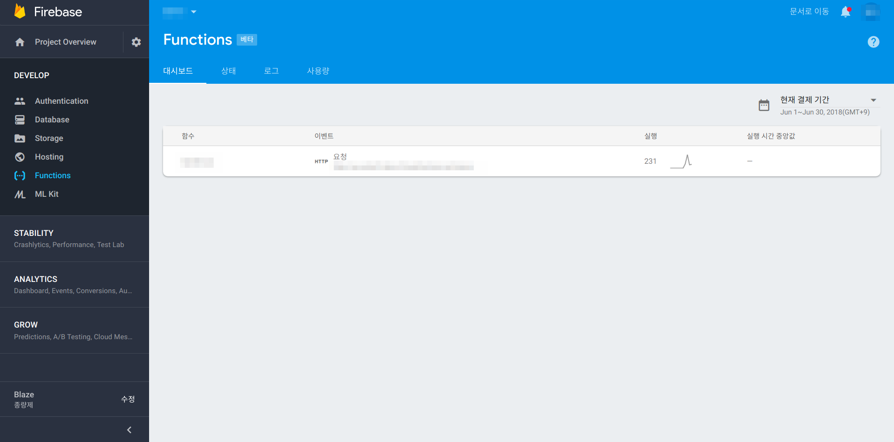


4. **Firebase Database Setup**
  - **You can get json file to input structure datasets in src/getFoodList**
  - To use Our code, you need two databases in FIREBASE. We use 2 databases.
  - **\<projet name>/\<Database name>/datasets/reports**
    - generated automatically
    
  - **\<project name>/\<Databse name>/datasets/structure**
    - (structure) should be pre-built in
    - You can run python scrapping code or insert data manually

  - **EX**
  
    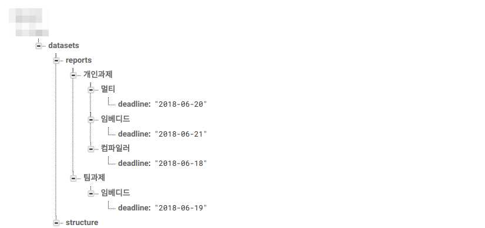

    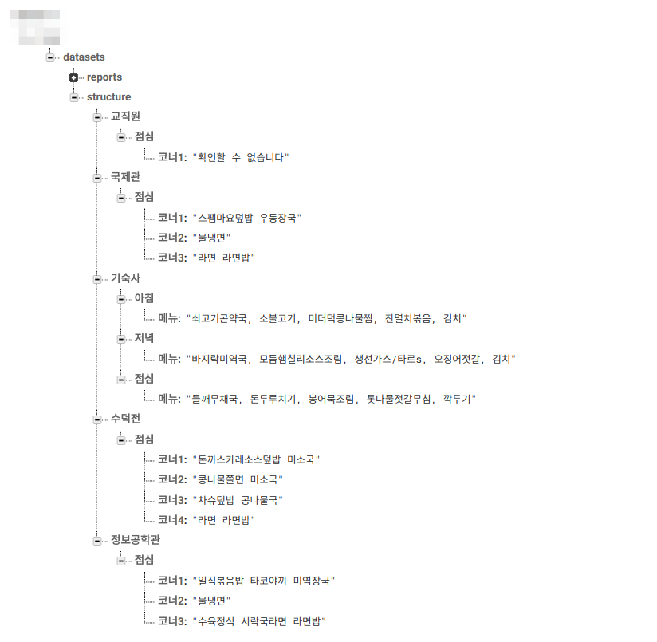

---

### 4. **Intergration**

1. **Test Your Dialogflow**

  - You can check response/request with json type in the right area of ​​the screen.

  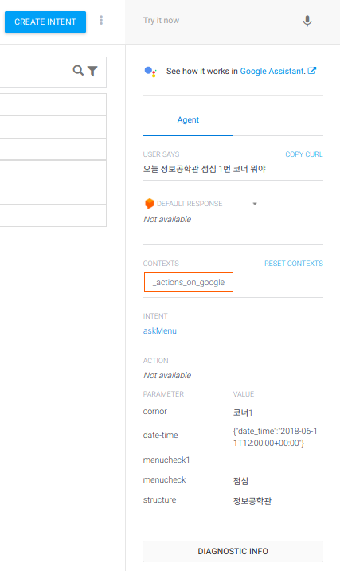

  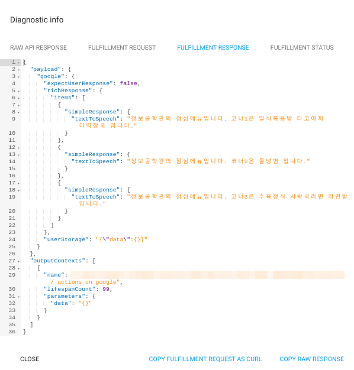


2. **Intergration**

  - **Integration your Dialogflow to google assistant**

  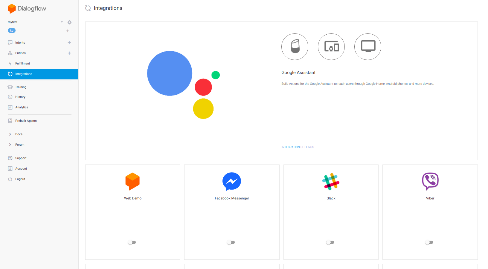

  - **add your own intent**

  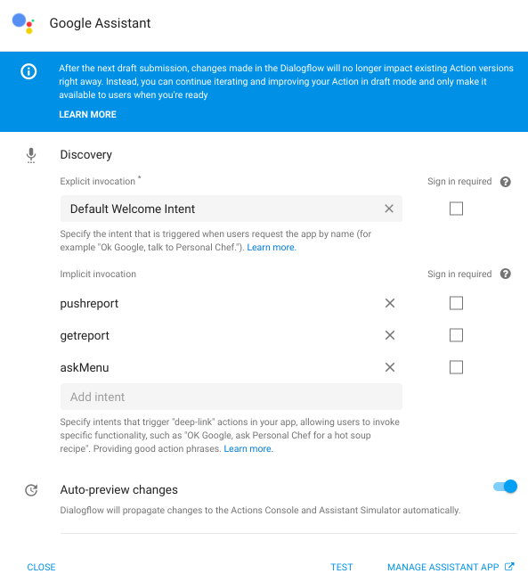

  - **test on your assistant simulation**

  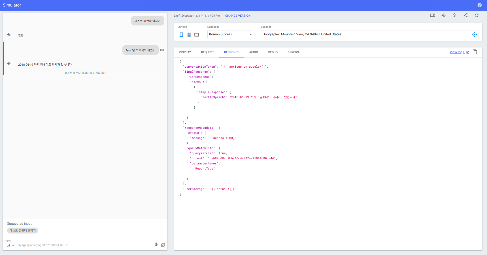

---
### 5. **Check**
- **You can see that data is being added to the database.**
- **BEFORE**

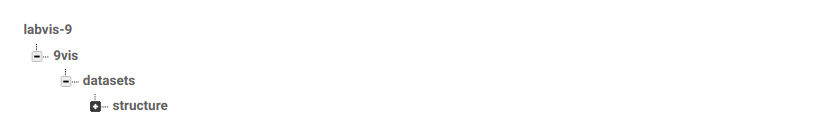

- **Talk to Dialogflow**

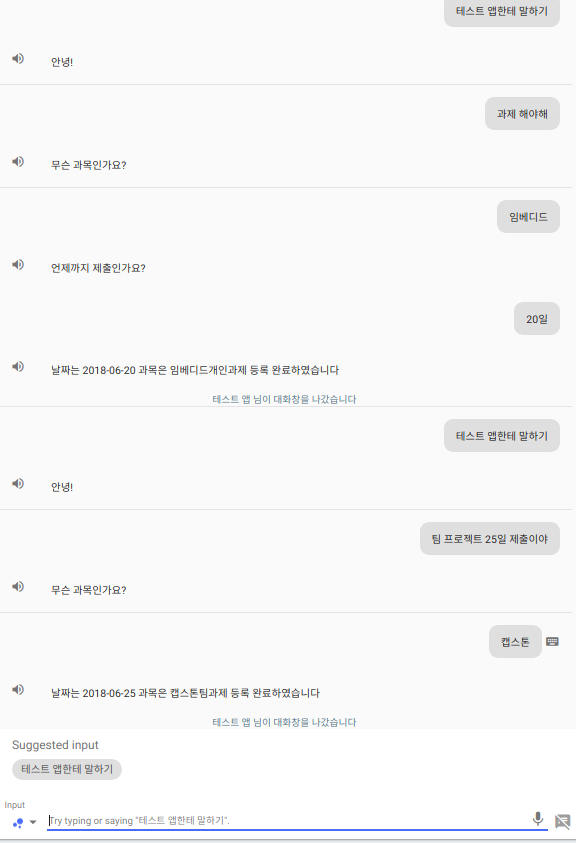

- **AFTER**

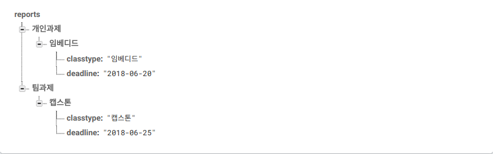


---

### Future Plans
  - **Make webhook server with own server instead of Firebase Platform.**
  - **Configuring Dialogflow and webhook, STT Separately**

---


***@Kim In Ju @Jin Soo Hyun***
