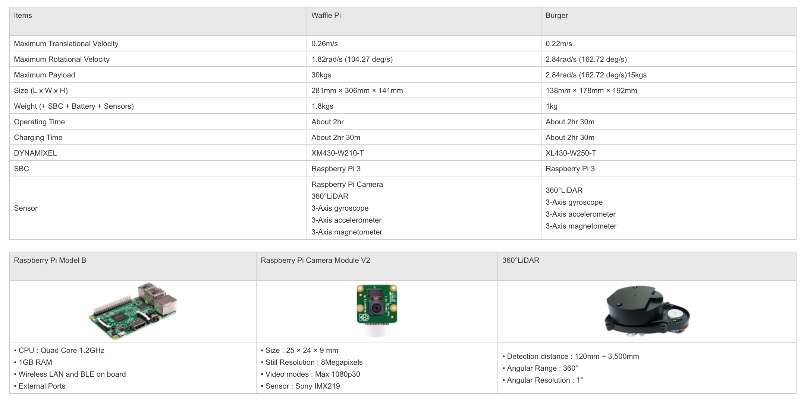
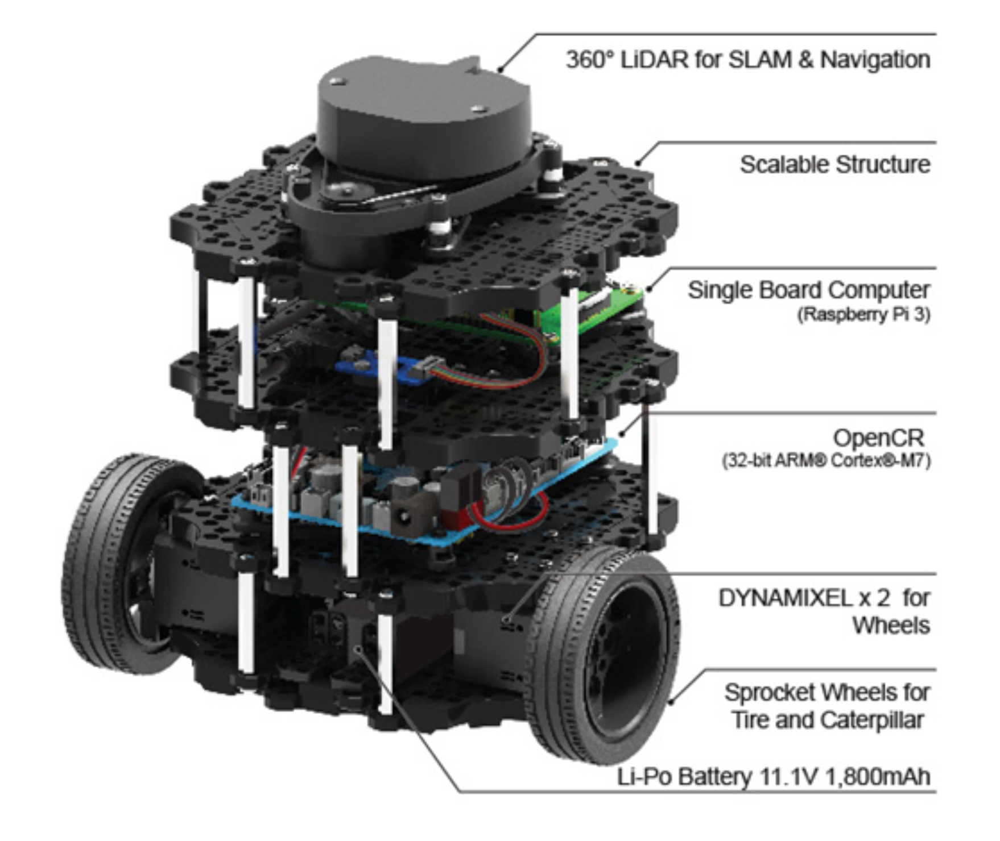
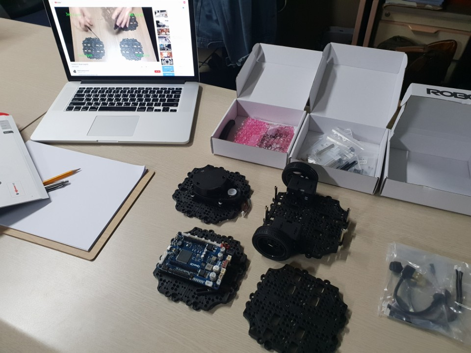
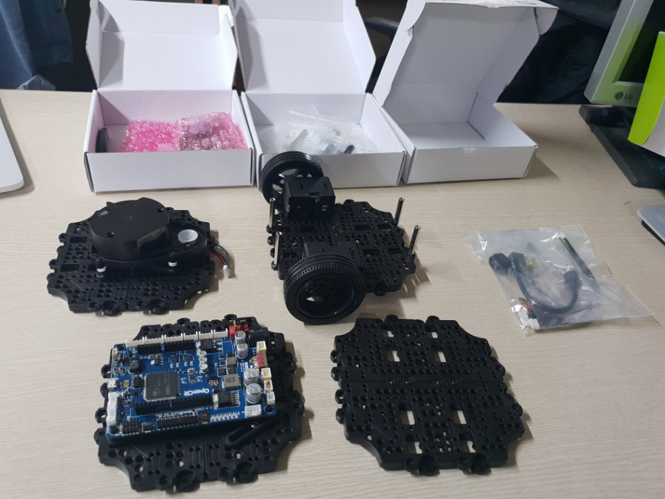
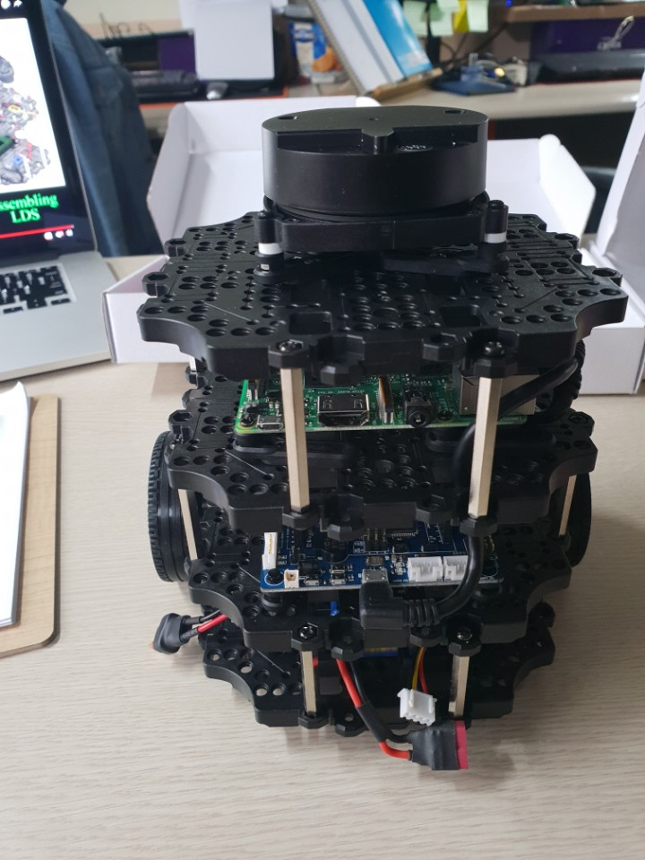
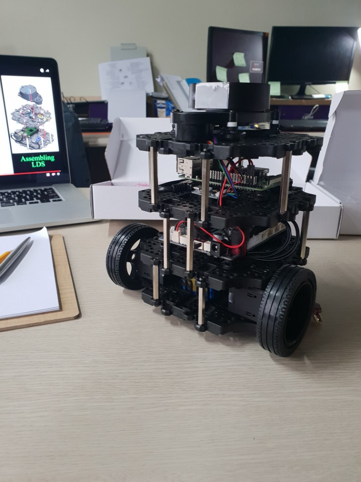

## 터틀봇 조립

- link : [https://www.youtube.com/watch?v=5D9S_tcenL4&feature=youtu.be]
- youtube link 영상 참고하여, 구성품 조립완료.
- 작업자 : jsh

 
#### Specification
- Bugger Model

 
#### Assembly Flow
- 총 4개의 Layer 구성 (1,2,3,4)
  - 1 Layer
    - Wheel, Battery, Battery Holder, Flat

  - 2 Layer
    - OpenCR

  - 3 Layer
    - Raspberry Pi3

  - 4 Layer
    - LIDAR & Navigation

 

- Layer 별, 조립1

 

- Layer 별, 조립2

 

- Layer 간 연동 및 부품 연결, 합선 작업 완료.
- 전체 구성1

 

- 전체 구성2

---
### 이후 예정 작업.
- Ubuntu Mate 내, ROS 올리기 (SD card)
- ROS Core 구동.
- Raspberry Pi3 1대 더 적재
  - Assistant, Mic, RGB Camera, CV, LIDAR 연동 용

- PI 클러스터링, 병렬 연결
